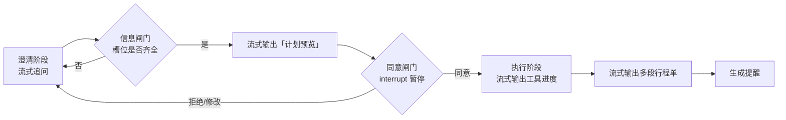

# 旅行规划 Agent —— 完整方案（单文档 · 可交接）

> **用途**：这是一份**自足**的方案。把本文档发给任意一个 AI 编程助手（或新对话），即可从零重建这个项目，无需其他资料。
> **一句话交接**：帮我按本文档实现一个"先问清 → 出计划 → 等同意 → 流式执行"的国内旅行规划 Agent，Web 端，非商业免费版，全部数据能力通过 MCP 接入。
> **版本**：v1 国内；v2 国际。**核实时间**：2026-09。文中"已核实"指当时实测，价格与配额请以官网为准。

---

## 目录

1. 项目定义
2. 已锁定的需求
3. 系统设计
4. 技术栈与工程结构
5. 数据源方案（免费版）
6. MCP 方案（核心）
7. 浏览器兜底层
8. 里程碑与起手式
9. 风险与缺口
10. 已定决策 vs 待定
11. 关键坑清单
12. 验证清单

---

## 1. 项目定义

### 1.1 一句话

一个把"我从某地想去某地"变成**可执行多段行程**的 Web Agent：**先问清 → 出计划 → 等同意 → 流式执行**，覆盖**门到门**（家门口 → 同城 → 城际 → 接驳 → 景区）。

### 1.2 目标

1. 通过对话把需求问清楚；
2. 调用工具查**天气 / 路线 / 城际交通**；
3. 让**天气与用户偏好共同参与**路线决策，并给出**可解释**的推荐；
4. 输出**多段（多 leg）**行程，覆盖同城、省内跨市、跨省三种尺度；
5. 交通票**与景区门票/预约**走**半自动**：Agent 查询/比价/备单，**付款由用户完成**。

### 1.3 明确不做（v1）

| 不做 | 原因 |
|---|---|
| 国际行程 | 推迟到 v2（需时区/货币/签证/跨境合规层） |
| 全自动支付下单 | 无官方授权下单接口；合规与资金风险 |
| 全自动抢票 / 自动候补下单 | 无授权接口，属高风险动作 |
| 无用户确认即调用工具 | 违反"双闸门"硬约束 |

### 1.4 前提（决定了成本与合规）

- **非商业目的的个人项目**，可分享但不商业化；
- **免费版**：数据源全部用免费额度 / 开源 / 免 key；
- v1 先做**自测版（pilot）**，自己跑通再放开。

---

## 2. 已锁定的需求

| ID | 约束 |
|---|---|
| R1 | 支持**多段、跨域**行程，不止小地区 |
| R2 | 执行前**双闸门**：信息完备 + 用户同意 |
| R3 | 大模型**流式**输出 |
| R4 | 工具按**风险分级**（只读 / 有副作用 / 不可逆） |
| R5 | 购票**半自动** + 幂等 + 审计 |
| R6 | **天气参与决策**，推荐可解释 |
| R7 | 国际支持（v2） |
| R8 | 景区**门票/预约**与交通票**同等对待** |
| R9 | 失败可**降级 / 可重规划** |

---

## 3. 系统设计

### 3.1 双闸门（整个系统的核心）



- **信息闸门**：用**确定性规则**校验槽位，缺则**批量追问**，不问齐不进执行。
- **同意闸门**：信息齐后先出**计划预览**（调哪些工具、动哪些数据、是否花钱、是否不可逆），用户显式同意才放行。
- **确认粒度**：L0 只读批量执行；**L1/L2 逐次 / 二次确认**。
- 同意要**留痕**（同意了什么、何时、针对哪版计划）；等待同意的会话可挂起并超时过期。

**必需槽位**：起点精确地址、目的地（长城要消歧到具体段）、出发日期与时间窗、人数与票种、交通偏好/预算/少走路/无障碍、是否需住宿、意图（只要建议还是要购票）、乘车人实名（仅购票时）。

### 3.2 工具风险分级

| 级别 | 例子 | 同意要求 |
|---|---|---|
| **L0 只读** | 地理编码、路径规划、天气、12306 余票**查询** | 计划确认后批量执行 |
| **L1 有副作用** | 提交预约、占座、锁定价格 | **逐次**确认 |
| **L2 不可逆 / 支付** | 付款、出票、退改 | **强确认 + 二次确认**，幂等 + 审计 |

### 3.3 流式（Web）

- **传输**：SSE 下行 + 普通 REST 上行；遇闸门发 `interrupt` 后**关闭该段流**，用户 approve/reject/edit 后**再开新流**从 checkpoint 续。
- **事件**：`reasoning_delta` / `text_delta` / `tool_call_start|delta|end` / `tool_result` / `plan_preview` / `interrupt` / `state_update` / `usage` / `error` / `done`。
- **容错**：工具调用参数需容忍**残缺 JSON**；长等待发心跳；断线用 `event id` + checkpoint 续，**不重跑已确认操作**。

### 3.4 跨域与尺度

- 行程是**多段图**：`Trip = [Leg…]`，段间强时序依赖（`Leg N 到达 + 缓冲 ≤ Leg N+1 发车`）。
- 用 `RouteScope ∈ {local, regional, intercity}` 统一尺度：**小地区 = 只有一个 leg 的退化情形**，同一内核。
- 编排用**父子图**：父图定主干与顺序，子图规划每段。

### 3.5 天气与偏好如何参与决策

| 天气因子 | 触发 | 动作 |
|---|---|---|
| 降水（雨/雪）| 中到大雨、降雪、结冰 | 建议改期或改低强度目的地；自驾降级 |
| 风速 | 大风 | 索道/缆车可能停运 → 改不依赖索道的段 |
| 雷暴 | 山区高发 | 强烈建议改期 |
| 能见度/霾 | 低能见度 | 观景类价值下降，提示换点 |
| 温度 | 高温/严寒 | 调整出发时段与装备 |
| AQI | 重度污染 | 纳入打分并提示 |

**偏好维度**：时间最短 / 费用最低 / 换乘最少 / 步行最少 / 准点率 / 舒适度 / 无障碍。权重优先追问，否则保守默认；用户可现场改权重重算。
**硬要求**：推荐理由里必须能指认是哪个天气或偏好因子起了作用。

### 3.6 状态机

`COLLECT`（澄清）→ `READY` → `PREVIEW` → `AWAIT_CONSENT` → `EXECUTE` → `DONE` / `FAILED` / `EXPIRED`

事件：`USER_REPLY`、`SLOT_COMPLETE`、`PLAN_READY`、`USER_APPROVE|REJECT|EDIT`、`TOOL_RESULT`、`TOOL_ERROR`、`APPROVAL_REQUIRED`、`RESUME`

要点：`AWAIT_CONSENT` 可被 `USER_EDIT` 拉回 `COLLECT`/`PREVIEW`；`EXECUTE` 中的 L1/L2 会再次进入 `AWAIT_CONSENT`。

### 3.7 数据模型

```
Trip
├── user_id（v1 单用户也保留，供多用户扩展）
├── origin / destination(s)
├── date_window（出发日期、总天数、返程要求）
├── travelers: [{ 人数, 票种, 实名信息（仅购票时） }]
├── preferences（交通偏好、预算、少走路、无障碍、备选容忍度）
├── legs: [Leg]
│     ├── route_scope: local | regional | intercity
│     ├── mode: 地铁 / 公交 / 高铁 / 航班 / 长途 / 自驾 …
│     ├── schedule: 发车 / 到达
│     ├── price
│     ├── booking: { 渠道, 预售期, 放票时刻, 候补, 深链参数 }
│     └── status: 建议 | 待确认 | 已下单 | 已出票
├── stays: [Accommodation]
├── tickets: [AttractionTicket{ 是否需预约, 余量, 分时段, 实名 }]
├── reminders: [Reminder]
├── consents: [{ 同意内容, 时间, 针对的计划版本 }]
├── constraints（时序衔接、时间窗、预算、一致性）
└── [v2 预留] currency / timezone / identity
```

### 3.8 购票：M1 + M2（无官方授权接口）

| 机制 | 说明 |
|---|---|
| **M1 深度跳转** | 备好车次/日期/席别/乘车人参数，一键跳官方 App/H5 页面，用户手动支付 |
| **M2 购票清单** | 输出结构化清单（车次、时刻、席别、人数、备选班次），用户自行下单 |

**连带约束**：查询数据属"尽力而为"（无官方开放接口）；**订单状态靠用户回执**推进，不是自动判定。

---

## 4. 技术栈与工程结构

| 层 | 选型 |
|---|---|
| 编排 | **LangGraph**（状态机 + `interrupt()` + checkpoint 一套机制覆盖） |
| 服务 | **FastAPI + uvicorn**（SSE + REST） |
| 校验 | **Pydantic v2** |
| 持久化 | SQLite 起步（checkpoint + session + consent + 订单） |
| 前端 | **React + Vite + TypeScript** |
| 测试 | pytest / pytest-asyncio；前端 vitest |
| 观测 | 结构化日志 + trace |

```
travel-agent/
├── app/
│   ├── api/      # FastAPI：/plan(SSE) /approve /sessions
│   ├── graph/    # LangGraph 父图 + 子图 + 状态（state.py / nodes / gates.py）
│   ├── mcp/      # MCP 适配层（本方案核心）
│   ├── tools/    # 统一工具契约 + 深链生成
│   ├── domain/   # Trip / Leg / Ticket / Consent
│   ├── policy/   # 天气规则、偏好打分、跨段约束校验
│   ├── events/   # 流事件类型与序列化
│   ├── store/    # checkpoint + session + consent
│   └── config/   # 配置与凭证（key 不进仓库）
├── web/          # React 前端
└── tests/
```

**分层职责**：交互层（Web）/ 流事件层 / 编排层（LangGraph）/ **MCP 适配层** / 决策策略层（确定性优先）/ 状态层 / 安全合规层。

---

## 5. 数据源方案（免费版）

### 5.1 三条纪律

1. **全部能力走 MCP**，Agent 只认统一工具契约；
2. **全部藏在适配层后面**，随时可换源、可降级；
3. **绝不商用、低频调用**（免费源能用下去的前提）。

### 5.2 逐环节方案

| 环节 | 免费源 | 形态 | key | 状态 |
|---|---|---|---|---|
| 天气 | **Open-Meteo** | HTTP | **不需要**（非商业免 key） | 已核实 |
| 天气（备） | 和风天气（天气类前 5 万次/月免费）/ `amap_weather` | API / MCP | 需要 | 已核实 |
| 地图 / 路线 | **amap-mcp-server** | MCP | 需要高德 Web 服务 key | 已核实 |
| 地图（免 key 备） | **@cyanheads/openstreetmap-mcp-server** / OSRM 自托管 | MCP / 引擎 | 不需要 | 已核实 |
| 火车 / 高铁 | **12306-mcp**（支持过站与中转查询） | MCP | 不需要 | 已核实 |
| 航班 + 空铁联运 | **@variflight-ai/variflight-mcp** / **@variflight-ai/tripmatch-mcp** | MCP | 需要（**送 ¥50 体验金**） | 已核实 |
| 酒店/景点/行程/火车票 | **@meituan-travel/ht-ai**（美团官方 Skill） | CLI / Skill | 需要（**个人可自助开通**） | 额度待确认 |
| 门票预约 / 打车 / 任意无 API 环节 | **huashu-chrome** 或 **@playwright/mcp**（带登录态浏览器） | MCP | 不需要 | 已核实 |

### 5.3 成本（已核实）

| 项 | 数值 |
|---|---|
| 高德基础 LBS（路径规划/地理编码/坐标转换等） | **个人认证 15 万次/月免费**（限非商业，**自认证起仅 1 年**） |
| 高德基础搜索（关键字/周边/输入提示） | 个人 **5,000 次/月**（配额远小于 LBS，省用） |
| 高德单价（超配额后） | 基础 LBS ¥30/万次、搜索 ¥30/万次 |
| 高德**商用**（本项目不需要） | 企业认证 + 技术服务许可 **¥5 万/年起** |
| Open-Meteo | **免费**（非商业免 key） |
| 12306-mcp | **免费**（非官方） |
| Variflight | 积分制（1 积分 = ¥0.01），**新用户送 ¥50 体验金** |
| 单次门到门规划 | 约 30 次地图 + 3 次火车 + 5 次天气 ≈ **< ¥0.15** |

### 5.4 待验证

1. 美团 `ht-ai` 的**免费额度**（需登录控制台看账单/配额）；
2. `@bxplucky/didi-ride-hailing` 是否可用；
3. 住宿是否纳入 v1。

> **这三项都不影响开工**——P0/M1 用的源都已确认可用。

---

## 6. MCP 方案（核心）

### 6.1 总体结构

```
Agent 编排层（LangGraph）
      │  只认统一工具契约
      ▼
MCP 适配层（启动 / 健康检查 / 超时 / 重试 / 降级 / 缓存 / 配额记账）
      │
      ├── amap-mcp-server            地图 · 路线 · 天气（需 AMAP_KEY）
      ├── openstreetmap-mcp-server   地图（免 key，备选）
      ├── 12306-mcp                  火车（免 key）
      ├── variflight-mcp             航班（需 VARIFLIGHT_API_KEY）
      ├── tripmatch-mcp              空铁联运（同一 key）
      ├── meituan ht-ai              酒店/景点/行程/火车票（需 token）
      ├── Open-Meteo                 天气（HTTP，免 key）
      └── huashu-chrome / playwright 浏览器兜底（免 key，带登录态）
```

### 6.2 地图 / 路线 —— `amap-mcp-server`

**12 个工具**：`amap_geocode`、`amap_direction_driving`、`amap_direction_transit`、`amap_direction_walking`、`amap_direction_bicycling`、`amap_poi_search`、`amap_poi_around`、`amap_distance`、`amap_poi_ranking`、`amap_poi_detail`、`amap_weather`、`amap_ip_location`

```json
{
  "mcpServers": {
    "amap": {
      "command": "npx",
      "args": ["-y", "amap-mcp-server"],
      "env": { "AMAP_KEY": "<高德 Web服务 Key，注意不是 Web JS API Key>" }
    }
  }
}
```

### 6.3 地图备源 —— `@cyanheads/openstreetmap-mcp-server`

6 个工具（含 `openstreetmap_search_places` 地名→坐标、逆地理编码、Overpass 空间查询）；**免 key**，Apache-2.0；支持 STDIO 或 Streamable HTTP，作者另有公有托管实例。国内公交弱，只做地理编码与空间查询。

```json
{ "mcpServers": { "osm": { "command": "npx", "args": ["-y", "@cyanheads/openstreetmap-mcp-server"] } } }
```

### 6.4 火车 —— `12306-mcp`

**能力**：查询购票信息、过滤列车、**过站查询**、**中转查询**（后两者对多段行程关键）。**免 key**；非官方，按 L0 只读、低频使用。

```json
{ "mcpServers": { "12306-mcp": { "command": "npx", "args": ["-y", "12306-mcp"] } } }
```

也支持 `npx -y 12306-mcp --port <端口>` 走 HTTP，或 Docker 部署。

### 6.5 航班 + 空铁联运 —— Variflight 飞友 AI 开放平台

两个产品：**Aviation MCP**（`@variflight-ai/variflight-mcp`，国内覆盖率 99.99%、国际 ≈97%）与 **Tripmatch MCP**（`@variflight-ai/tripmatch-mcp`，含**空铁联运**）。

**工具与单价**（1 积分 = ¥0.01）：

| 工具 | 用途 | 单价 |
|---|---|---|
| `searchFlightsByDepArr` | 直飞航班 | 50 = ¥0.50 |
| `getFlightPriceByCities` | 逐航班逐舱位票价 | 50 = ¥0.50 |
| `searchFlightItineraries` | 行程推荐摘要 | 50 = ¥0.50 |
| `getFlightTransferInfo` | 航班中转 | 25 = ¥0.25 |
| `getFlightAndTrainTransferInfo` | **空铁联运**中转（Tripmatch） | 25 = ¥0.25 |
| `flightHappinessIndex` | 准点/机型/餐食/行李 | 25 = ¥0.25 |
| `searchTrainTickets` | 火车票时刻与余票 | 25 = ¥0.25 |
| `getFutureWeatherByAirport` | 机场 3 天天气 | 10 = ¥0.10 |
| `getRealtimeLocationByAnum` | 机尾号实时位置 | 10 = ¥0.10 |
| `searchTrainStations` | 火车站搜索 | 5 = ¥0.05 |
| `getTodayDate` | 当天日期 | **免费** |

**计费规则（已核实）**：**新用户注册送 ¥50 体验额度（= 5,000 积分），无需充值即可调用**；协议层调用（`initialize`、`tools/list`）与 `getTodayDate` **免费**；**调用失败不扣费**；充值另赠 **4 倍等值额度**（30 天）；余额耗尽返回 **403**。
**鉴权**：请求头 `X-API-Key`；也支持 OAuth 2.1（token 1 小时）；远程 HTTP 或本地 stdio 皆可；每账号最多 30 个 key。

```json
{
  "mcpServers": {
    "variflight": {
      "command": "npx",
      "args": ["-y", "@variflight-ai/variflight-mcp"],
      "env": { "VARIFLIGHT_API_KEY": "<key，申请自 mcp.variflight.com>" }
    }
  }
}
```

### 6.6 酒店 / 景点 / 行程 —— 美团 `ht-ai`（官方 Skill）

```bash
export MEITUAN_HT_TOKEN=<token>     # developer.meituan.com 控制台 → Token 管理
npx @meituan-travel/ht-ai query --query '北京到上海的机票'
```

**接入门槛（已核实）**：**个人开发者可自助开通**（登录美团账号即自动开通开发者账号），每人最多 **5 个 Token**、**长期有效**、删除立即失效；平台会自动废用已泄露的 Token。
**能力**：官方文档列 景点推荐、酒店推荐、行程规划、火车票查询（包自述另含机票查询）。
**注意**：请求应发往 `https://mcp-open-cater.meituan.com`；退出码 `3` = 鉴权失败；**免费额度未公开**，需登录控制台确认；AI Hub 的「AI Coding 套件」走**企业类型 Token**，与个人 Token 是两条路。

### 6.7 天气 —— Open-Meteo（HTTP，免 key）

非商业**免注册、免 key**（官方文档明确 `apikey` 仅商用需要），直接 HTTP 调用，无需 MCP。备源用 `amap_weather`。

### 6.8 一份配置装齐

```json
{
  "mcpServers": {
    "amap": {
      "command": "npx",
      "args": ["-y", "amap-mcp-server"],
      "env": { "AMAP_KEY": "<高德 Web服务 Key>" }
    },
    "osm": { "command": "npx", "args": ["-y", "@cyanheads/openstreetmap-mcp-server"] },
    "12306-mcp": { "command": "npx", "args": ["-y", "12306-mcp"] },
    "variflight": {
      "command": "npx",
      "args": ["-y", "@variflight-ai/variflight-mcp"],
      "env": { "VARIFLIGHT_API_KEY": "<Variflight Key>" }
    }
  }
}
```

### 6.9 工具 → 决策映射

| 决策 | 用哪个工具 |
|---|---|
| 起点是否够精确 | `amap_geocode` |
| 这段路怎么走 | `amap_direction_transit / driving / walking / bicycling` |
| 目的地是哪个（长城哪一段） | `amap_poi_search` + `amap_poi_detail` |
| 天气能不能去 | Open-Meteo / `amap_weather` |
| 跨省坐什么 | `12306-mcp`（含**中转查询**）/ Variflight（含**空铁联运**） |
| 多少钱 | `getFlightPriceByCities` / 12306 查询 / 美团 `ht-ai` |
| 酒店与景点 | 美团 `ht-ai` |
| 末段接驳 | `amap_direction_*` |
| 门票 / 打车 | 浏览器 MCP（同意后执行） |

### 6.10 MCP 适配层的要求

1. **只认统一契约**：编排层不直接依赖任何 MCP 的具体工具名，由适配层映射；
2. **启动与健康检查**：应用启动时拉起并 `connect()`，失败不阻断整体；
3. **超时与重试**：每调用设超时，失败退避重试后**降级**（缓存 → 给方案不给实时数据 → 跳转）；
4. **缓存**：天气/路线短 TTL，余票极短 TTL；
5. **配额记账**：按源统计调用量，接近限额自动降级（尤其高德**搜索池只有 5,000/月**）；
6. **失败可解释**：告诉用户"这个源现在不可用"，不静默吞掉。

### 6.11 凭证安全

`AMAP_KEY` / `VARIFLIGHT_API_KEY` / `MEITUAN_HT_TOKEN` **只进环境变量**；不进代码、不进日志、不进仓库。

---

## 7. 浏览器兜底层（补齐无 API 环节）

**覆盖**：门票预约、打车、以及任意没有 API 的环节。

**原理（五层）**：`npm 包 → CLI → MCP server → 本地桥(127.0.0.1) → Chrome 扩展`，用**用户日常 Chrome 的登录态**操作真实页面。

**核心原则**：**「工具返回『已点击』不算数，页面真的动了才算」**——每步以页面真实状态验收。

**接入**：装服务 → 装扩展连本地桥 → 封装成工具组（导航/读取/点击/输入/等待/截图）→ **挂同意闸门** → 页面状态校验。
**流程**：`EXECUTE → 遇到浏览器任务 → AWAIT_CONSENT（展示：去哪、点什么、填什么）→ 用户同意 → 驱动页面 → 校验 → 回主流程`。**付款永不自动**。

| | huashu-chrome | @playwright/mcp | chrome-devtools-mcp |
|---|---|---|---|
| 用日常 Chrome 登录态 | ✅ 即当前浏览器 | ⚠️ 需扩展模式 | ⚠️ Chrome 144+ 逐次授权 |
| 是否需开调试端口 | ✅ 不用 | 扩展模式才免 | ❌ 需开远程调试 |
| 注意 | 第三方小项目 | 微软官方 | 谷歌收使用统计（可关） |

**建议**：`huashu-chrome` 做主、`@playwright/mcp` 做备。

**落地顺序**：① 先只做深链跳转 → ② 再用浏览器 MCP 做 12306 **只读**查询 → ③ 最后才做写操作。

---

## 8. 里程碑与起手式

| 阶段 | 目标 | 验收 |
|---|---|---|
| **M0** | 骨架 + MCP 适配层 + 槽位/状态模型 | 至少一个 MCP 工具可调用；空跑澄清→闸门→执行 |
| **M1** | local 单 leg：地图 + 天气 + 双闸门 | "朝阳区某点→长城"出带理由的方案 |
| **M2** | 流式事件协议 | 信息齐才执行；可暂停/续传；残缺 JSON 不崩 |
| **M3** | intercity 多 leg：12306 + 约束校验 | 跨省多段衔接正确（含中转） |
| **M4** | 航班 / 空铁联运 / 美团接入 | 含中转与价格的方案 |
| **M5** | 半自动购票 + 浏览器兜底 | 查询自动、付款需确认、幂等生效 |
| **M6** | 自测版（pilot） | 按一条真实行程端到端跑通 |
| v2 | international | 时区/货币/签证/跨境合规 |

**建议起手式**：**M0 + M1**。骨架、双闸门与地图/天气都不依赖航班/美团验证结果，可立即开工。

---

## 9. 风险与缺口

| 风险 | 应对 |
|---|---|
| 免费源非官方、可能限流失效 | 适配层隔离 + 失败降级为"跳转 + 清单" |
| 高德额度**仅 1 年、限非商业** | 到期前评估；转商用需企业认证 + 许可（¥5 万/年起） |
| 浏览器 MCP 是第三方小项目 | Playwright MCP 做备 |
| 第三方 token 泄露 | 只进环境变量；不打印、不入库 |
| 门票预约无专用 MCP | 浏览器 MCP（本人账号）或人工维护小表 |
| 打车无免费 API | 深链跳转 |
| 航班为积分制（非免费） | ¥50 体验金起步；单价极低（¥0.25–0.50/次） |

**明确缺口**：门票预约、打车（这两条靠浏览器兜底或跳转）。

---

## 10. 已定决策 vs 待定

### 已定

| 项 | 决定 |
|---|---|
| 目标形态 | 非商业个人项目；v1 先做自测版；数据模型仍带 `user_id` |
| 票务接口 | **无官方授权下单接口** → M1 + M2；支付全在用户侧；订单状态靠用户回执 |
| 交互通道 | **Web** → SSE + REST 上行 |
| 技术栈 | LangGraph + FastAPI + Pydantic v2 + SQLite + React/Vite |
| 范围 | v1 国内（local/regional/intercity）；国际推迟 v2 |
| 数据源 | 见 §5、§6（高德 + Open-Meteo + 12306 MCP + Variflight + 美团 + 浏览器兜底） |

### 待定

1. 美团 `ht-ai` 的免费额度；
2. `@bxplucky/didi-ride-hailing` 是否可用；
3. 住宿是否纳入 v1；
4. 多用户上线时点（鉴权与租户隔离）。

---

## 11. 关键坑清单

| 坑 | 说明 | 对策 |
|---|---|---|
| **坐标系不一致** | 高德/腾讯用 GCJ-02、百度用 BD-09、GPS 用 WGS-84，不转换会有**几百米偏差** | 统一用坐标转换后再拼接 |
| **高德搜索池只有 5,000/月** | LBS 池 15 万/月，但关键字/周边搜索是另一个小池 | POI 消歧优先走**地理编码**而非关键字搜索 |
| **canvas / 封闭 shadow DOM** | DOM 里搜不到元素（如飞书多维表格、小红书发布按钮） | 需坐标或站点专用处理 |
| **后台标签页不渲染** | SPA 在后台标签页不渲染 | 强制前台执行 |
| **多 agent 抢页** | 并发会话互相干扰 | 每会话一槽，冲突当场拦 |
| **日期与代码格式** | 日期必须 `YYYY-MM-DD`；机场/城市用 IATA 三字码；火车用中文城市名 | 先调 `getTodayDate` 再推算相对日期 |
| **工具调用超时** | 航班列表类查询数据量大，单次约 30 秒上限 | 提示词先明确城市与日期 |
| **12306 余票需 cookie** | 余票查询必须在浏览器里发；**票价是另一个接口** | 用带登录态的浏览器 MCP |

---

## 12. 验证清单

| 变更面 | 最小验证 |
|---|---|
| 槽位校验 | 单元测试：缺槽位必须追问、**不得进入执行** |
| 闸门 | `interrupt` 暂停/恢复、拒绝分支、**同意前 0 次非只读调用** |
| 工具契约 | 每个工具 schema 与错误路径单测 |
| 流协议 | 事件序列契约测试（含**残缺 JSON 容错**） |
| 约束求解 | 跨段衔接/预算/时间窗边界用例 |
| 断线续传 | 重连从 checkpoint 续、**不重复下单** |
| 端到端 | 黄金行程回归（local + intercity 各一条） |

**可度量验收**：信息闸门 100% 拦截缺槽位；同意前 0 次非只读调用；断线恢复不重复下单；每条推荐的理由中至少含一个可指认的天气或偏好因子。

---

## 附：本方案覆盖的原始例子

以"朝阳区某点 → 长城"验证设计能覆盖真实复杂度：

- **起点粒度**：朝阳区很大，望京 / 国贸 / 十里堡到不同车站差别巨大 → 必须拿到精确地址；
- **目的地方案化**：八达岭（S2 线 / 京张高铁 / 877 路）、慕田峪（直通车 / 公交）、司马台（直通车 / 自驾）差异大 → 先给候选；
- **门票**：长城各段多需**实名预约限流** → 预约与车票并列；
- **天气**：大风/雷雨影响索道，雪/结冰影响部分段 → 触发改段或改期；
- **尺度**：北京→长城属 local/regional 边界；把目的地换成"成都"即自动进入 intercity 多段，**内核不变**。
